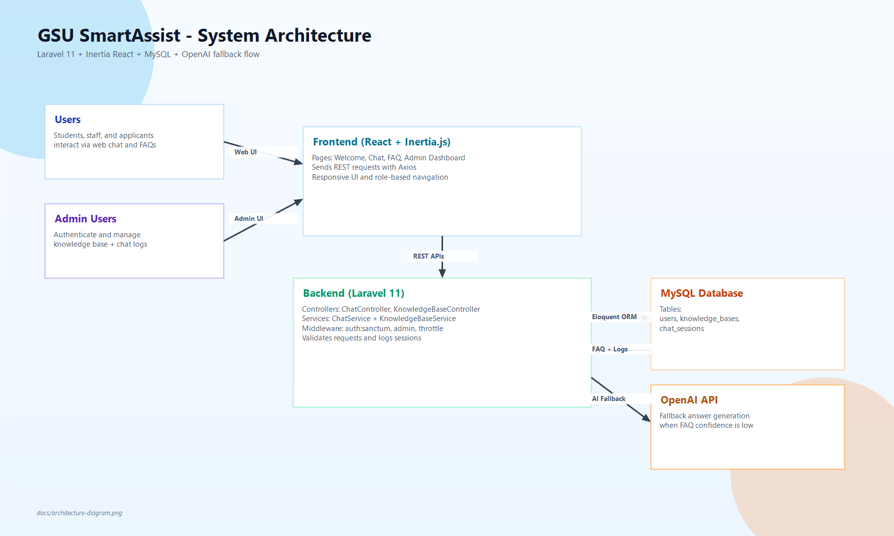
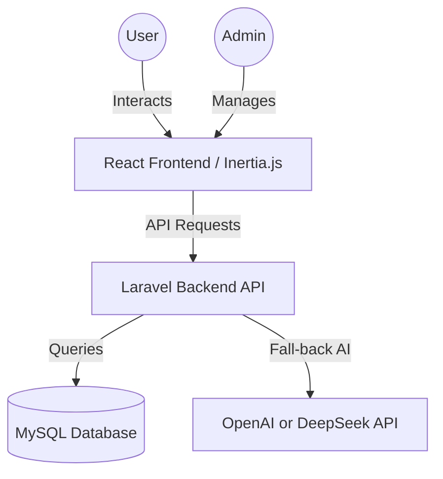

# GSU SmartAssist Architecture

The GSU SmartAssist application follows a decoupled architecture using Laravel for the backend and React (via Inertia.js) for the frontend.

## Architecture Diagram (Image)

## System Overview

## Backend Architecture
- **Controllers**: Handle HTTP requests and validation.
- **Services**: Contain business logic (e.g., `ChatService` handles the logic of searching the KB vs. calling the configured AI provider).
- **Models**: Eloquent models for `User`, `KnowledgeBase`, and `ChatSession`.
- **Middleware**: Handles authentication (`Sanctum`) and rate limiting (`Throttle`).

## Data Flow (Chat)
1. User sends a message via the **Chat Interface**.
2. React frontend sends a POST request to `/api/chat`.
3. Laravel **ChatService** searches the **KnowledgeBase** table for matching keywords.
4. If found, the pre-defined answer is returned.
5. If NOT found, the request is sent to the configured **AI provider (OpenAI or DeepSeek)** with university context.
6. The final response is saved to **ChatSessions** and returned to the user.
